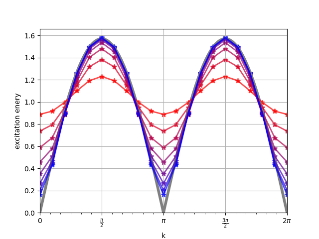

# Bfpt

## What it is

# Bfpt solver

`Bfpt` (Brute Force Perturbation Theory) is a numeric solver of quantum Hamiltonian eigenproblem for finite discrete one dimensional periodic systems.

The solver performs exact denationalization (ED) in a subspace of the system Hilbert space. The subspace is constructed in a spirit of perturbation calculus. The construction starts with the `0`-th order subspace filled exclusively with quantum states provded (as an input) by the solver user. Then the next order subspaces are constructed iteratively: The `(n+1)`-th order subspace is the `n`-th order subspace extended by the Hamiltonian image of the `n`-th order subspace. The solver user defines the target subspace order. Having the desired subspace constructed, Hamiltonian restricted to the subspace is diagonalized using a spare matrices numeric method.

Note that for sufficiently high value of the order parameter the relevant subspace is an invariant subspace of Hamiltonian and
the solver performs "full" ED.

All calculations (both at the subspace generation stage and the diagonalization stage) are performed in the 'inverse space' (or 'momentum space') -- in the realm of quantum states with given Bloch's theorem pseudo-momentum.

The archetype problem fitting the solver domain is one dimensional Heisenberg antiferromagnet. Even though the Heisenberg model is a lighthouse for development, the author's original motivation is to address spin-orbital Kugel–Khomskii models (like the one described for copper fluoride KCuF₃).

# Bfpt project

The project provides codebase for the `bfpt` solver components libraries as well as codebase of applications that integrates the solver soluton for real physical problem analysis.

The solver is conceived to be general and easily extensible so to encourage further experimenting. The project tries to achieve the objectives by involving easy to play modern C++ with balanced static and dynamic polymorphism, limited usage of external libraries focusing only on battle-tested ones: `boost C++` libraries for general purposes and `Armadillo`, `LAPACK`, `ARPACK`, `BLAS` libraries stack for linear algebra.

## What it is not

- The solver is not meant to be a competitor for Bethe ansatz based solutions.
- Bfpt is not meant to be the fastest numeric solver created.
- Bfpt is not meant to target continuous systems.
- Bfpt is not meant to target  two and more dimensional systems.

# `bfpt` solver design

## Plugable core

`bfpt` solver is a collection of small weakly coupled software libraries capable to work together.
Rather than implementing a very general solution in a monolith library,
`bfpt` lets a few smaller plug-able components to define parts of the overall problem and provide the desired implementation of the parts.
`bfpt_common_recipe` is a function that merely orchestrates the standard calculation workflow taking advantage of the provided implementations.
The workflow includes the following steps.
- Generating the "populated basis" in which ED should be performed,
- Generating the matrix for Hamiltonian restricted to the subspace,
- Performing the matrix ed to find the lower-energy eigenstate,
- Performing basic post-processing:
  - printing results,
  - calculating reduced density operator matrix,
  - calculating mean value for some given operators.

For convenience `bfpt` splits the **physical problem definition** into two separate definition layers:
- in the first layer relevant _Hilbert space_ is concertized,
- in the second layer relevant _Hamiltonian operator_ is concertized.
In addition for `bfpt` calculations to run **approximation definition** needs to be provided.
("Approximation" here means the departure of full Hilbert space ED.)
For this rules for generating the "populated basis" need to be stipulated, what includes:
- providing _`0`-th order basis_ elements,
- providing _pupulator map_, stipulating rules how `n+1`-th order basis is constructed from `n`-th order basis,
- providing the _desired order_ basis order.

One of the key feature of `bfpt` is try not to provide an optimal/convenient implementation capable for 
work well with a wide range of physical problems.
Letting the user to provide the right **implementation definition** together with the problem definition.

For example defining the _Hilbert space_ one need to define: number of nodes and node quantum states.
For convenience also the states ordering should be imposed.
But in addition to the _pure_ physical problem definition one need to specify the underlying programmatic implementation.
This makes it possible to consider chains with the node number known at the compilation time,
flexible states that allocates dynamically as much memory as needed.
It also makes it possible to have a general state -- working well for chains of any kind of physical system as nodes,
but at the same time lets the user to provide an optimized chain states implementation that "compress" data in a fancy way.
Similar consideration may by carried out for _Hamiltonian operator_ and _populator map_.

The flexibility is achieved by letting the Hilbert space definition to be a type definition.
`bfpt common recipe` function is a template function that accepts any type intended to work as a Hamiltonian definition.
The library provides `kstate_trait` to specialize

```
                                         +----------------------+
KstateTait : Type                   ---> |                      |
                                         |                      |
KoperatorTrait : Type               ---> |  bfpt common recipe  | ---> lower-energy eigenstate : (Number, Vector)
hamiltonian : Koperator             ---> |  <KstateTait,        |
                                         |   KpopulatorTait,    |
KpopulatorTait : Type               ---> |   KoperatorTrait>    |
populator : Kpopulator              ---> |  (hamiltonian,       |
0-th order basis : Set<Kstate>      ---> |   populator,         | ---> one-node reduced density operator : Matrix
desired order : Number              ---> |   zero_order_basus,  | ---> two-nodes reduced density operator : Matrix
                                         |   ...)               |
operators_for\                           |                      |   
average_calculation : Set<Matrices> ---> |                      | ---> averges for given operators : Numbers
                                         |                      |
                                         +----------------------+
```

Hilbert space definition is provided by `kstate` prescribed by KstateTait

## Implemented plugins


### Bfpt Systems -- Hilbert space definition layer

`Bfpt` solver may be applied to any finite discrete one dimensional periodic systems.
Any such system may be perceived as a chain made of replicas of a node subsystem.
`Bfpt Systems` is to concretize the node subsystem. The concretization covers:
- The total number of possible node states.
- String representation of the node states.

At this layer of abstraction _system definition_ to _real physical system_ association is not demanded.
One may define a `bfpt` system for a specyfic physical system (aka: `strong typing` system definition),
but is free to left the association unstated (aka `weak typing`).

The pros of `strong typing` system definitions:
- the node states string representation may be as accurate/precise as possible;
- it makes the _system definition_-to-applicable-_Hamiltonian definitions_ relationship more explicit at type theory level.
- one may add a domain specific functionality so to make the solve results posprocesing easier.

The pros of `weak typing` system definitions:
- useful when relevant methematic descrition is "physical system independent",
- when one wants to reuse a simple system defintion many times.

**Implemented system types** The project provides two system types:
- `monostar system`, and
- `spin-orbit system` [TODO].
It is an easy task to define a new system type concretization.

`monostar system` is defined as a quantum systems made of replicas of a two-level subsystem.
The replicas are arranged in a way they form a chain (and here will be called chain nodes).
A chain node quantum levels are denoted: `gs` and `es` (like ground state and excited state);
although there is no implied states non-degeneracy condition.

`spin-orbit system` is defined as a quantum systems made of replicas of a spin-orbit subsystem.
for spin dublets and `e_g` orbitals.
A chain node quantum levels are denoted by two-letters strings: `gg`, `ge`, `eg`, `gg`,
where the first letter codes the spin state and the second codes the orbital state.
(More about the codding convention below.)

At this level of abstraction _system definition_ to _real physical system_ association is not demanded.
In case of `monostar system` the concete physical realization is left unspecified.
It makes it unversal and ready to use in many contexts.
One may take advantage of it when analyzing spin dublets, system of `e_g` orbitals, or any other two-level system.

The specyfic meaning of "two-level subsystem" is not relevant at the system level definition.

### Physical interactions -- Hamiltonian operator definition layer

`Bfpt` solver performs all the calculations in Bloch space.
`Bfpt Hamiltonian` is to concretize the energies and the couplings.

**Implemented system types** The project provides one hamiltonian type:
- `kerneled Hamiltonian`

`kerneled Hamiltonian` is for hamiltonians defined by _on-site_ interactions and _nearest neighbors_ interactions.
In this case the chain Hamiltonian `ℋ` is expressed as `ℋ = ℋ₁ + ℋ₁₂`, where
- `ℋ₁ = Σ_{i} H₁(i)`,
- `ℋ₁₂ = Σ_{<ij>} H₁₂(i,j)` (with the summation over pairs of adjacent nodes);
and thus prescribed by two-nodes kernel Hamiltionians
- one-node kernel Hamiltionian `H₁`,
- two-nodes kernel Hamiltionian `H₁₂`.

The hamiltonian type is parametrized by `H₁` and `H₁₂`.
The type is a template type and may be instantiated for any _ststem type_.

### Approximation specification -- Basis populator definition layer

[TODO]


# Usage examples: `monostar_app`

The project contains an executable (`monostar_app`) 
integrating the `bfpt` solver for analysis of two-level systems.
The considered models are:
- 1D Heisenberg ferromagnet spin-dublets chain,
- 1D Heisenberg antiferromagnet spin-dublets chain,
- 1D `e_g`-type orbitals chain (where `e_g` is a symbol of a irreducible representation
of `Oh` point symmetry group).

## Models details:

### 1D Heisenberg (anti)ferromagnet

** Model monostat with `af` and `fm` Hamiltonians **

The model goes in two flavors: `fm` and `af`, each parameterized with two real values `J_classical` and `J_quantum`.
The `H_12_diag` does not depend on the `fm`/`af` variant and is governed by `J_classical`:
| states pair | energy contribution |
|-------------|---------------------|
| `(gs, gs)`  | `-J_classical/4`    |
| `(gs, es)`  | `+J_classical/4`    |
| `(es, gs)`  | `+J_classical/4`    |
| `(es, es)`  | `-J_classical/4`    |

`H_12_off_diag` in `fm` model variant is given by:
| coupled states pairs    | coupling contribution |
|-------------------------|-----------------------|
| `(es, gs)` ⟷ `(gs, es)` | `-J_quantum/2`        |

`H_12_off_diag` in `af` model variant is given by:
| coupled states pairs    | coupling contribution |
|-------------------------|-----------------------|
| `(gs, gs)` ⟷ `(es, es)` | `+J_quantum/2`        |

`fm` monostar model is trivially equivalent to Heisenberg ferromagnet model with `gs` translated into `spin down` and `es` translated into `spin up`. `af` monostar model is equivalent to Heisenberg antiferromagnet with the monostar states to spin states association given by `gs`≡`down`, `es`≡`up` for nodes on one magnetic sub-lattice, and `gs`≡`up`, `es`≡`down` on the other.
To keep the equivalence explicit, here term "monostar model" is used instead of "Heisenberg (anti)ferromagnet mode" to avoid confusion.

** Results from bftp solver **

The plot below presents the system Hamiltonian eigenenergies for `af` monostar system of 20 nodes calculated with `bfpt` at different levels of approximation. The considered system states are: the system ground state (horizontal lines on the plot) and system states from the first excited band (the curves on the plot). Result obtained in calculations with the Hilbert space subspaces of orders from 1 to 8 (inclusive) are represented by lines with colors going from red to blue. In addition exact results for infinite chain was included for reference; the reference energies are represented by gray lines. (The ground state energy was scaled so to preserve the quantum correlation energy per node.)


The model excitation energies are obtained as a difference of the relevant excited states energy and the ground state energy.



The content of the eigenstates may be printed in a pretty form in which the state configuration contributions for are sorted and displayed in human friendly way. The screenshot below shows the decomposition of the groundstate of 16 nodes `af` monostar model.


### `e_g`-type orbitals chain

**Notation** Below we assume `e_g` oribtal space consists of linear combinations of
the two basis oribtals: `|x² - y²⟩` and `|3z² - r²⟩`.

The system hamiltonian is often expressed in terms of
one-orbital projection operatos like these four:
```
Pᶻ = |z⟩⟨z|,         Pˣ = |x⟩⟨x|,
P⁺ = |+⟩⟨+|,         P⁻ = |-⟩⟨-|,
```
where:
`|x⟩` and `|z⟩` are shortcut notation of `|x² - y²⟩` and `|3z² - r²⟩`,
`|+⟩` and `|-⟩` denotes `(|z⟩+|x⟩)/√2` and `(|z⟩-|x⟩)/√2`.

The matrix representatrion of the projection operators
in the (`|z⟩`, `|x⟩`) basis is as follow:

```
        |z⟩ |x⟩                       |z⟩ |x⟩
      ╭        ╮                    ╭        ╮
 Pᶻ = │ +1   0 │  |z⟩          Pˣ = │  0   0 │  |z⟩
      │  0   0 │  |x⟩               │  0  +1 │  |x⟩
      ╰        ╯                    ╰        ╯

        |z⟩ |x⟩                       |z⟩ |x⟩
      ╭        ╮                    ╭        ╮
 P⁺ = │ +½  +½ │  |z⟩          P⁻ = │ +½  -½ │  |z⟩
      │ +½  +½ │  |x⟩               │ -½  +½ │  |x⟩
      ╰        ╯                    ╰        ╯
```
We also define τ operators:
```
 τᶻ = |z⟩⟨z| - |x⟩⟨x|
 τ⁻ = |-⟩⟨-| - |+⟩⟨+|
```

**Hamiltonian definition** The system Hamiltonian `ℋ` is parametrized by five real params:
`tau_z_coef`, `tau_minus_coef`, `Pzz_coef`, `Pxz_coef`, `Pxx_coef`.
```
ℋ = ℋ₁ + ℋ₁₂
```
with:
```
ℋ₁ = ℋ₁ᶻ + ℋ₁⁻
ℋ₁ᶻ = Σ_i tau_z_coef τᶻ(i)
ℋ₁⁻ = Σ_i tau_minus_coef τ⁻(i)
```
and
```
ℋ₁₂ = ℋ₁₂ᶻᶻ + ℋ₁₂ˣᶻ + ℋ₁₂ˣˣ
ℋ₁₂ᶻᶻ = Σ_<ij> Pzz_coef (Pᶻ(i) Pᶻ(j))
ℋ₁₂ˣᶻ = Σ_<ij> Pxz_coef (Pˣ(i) Pᶻ(j) + Pᶻ(i) Pˣ(j))
ℋ₁₂ˣˣ = Σ_<ij> Pxx_coef (Pˣ(i) Pˣ(j))
```

**`e_g` space base for calculations** In the program all calculations are performed in "rotated orbitals"
basis. It is defined by a single parameter `θ` (called "orbital_theta")
by the relation:
```
 ╭         ╮     ╭         ╮              ╭                        ╮
 │ |∥⟩ |⟂⟩ │  =  │ |x⟩ |z⟩ │ β, where β = │  +cos(θ/2)   -sin(θ/2) │
 ╰         ╯     ╰         ╯              │  +sin(θ/2)   +cos(θ/2) │
                                          ╰                        ╯
```
Value of "orbital_theta" may be requested by the application user "on demand",
or the user may let the program to choose the "best" value automatically.
Here "the best" is defined as a value that minimizes the energy
of the chain of not entangled oritals.

## CLI

## Compile/build/install/use 

### Docker
The simplest way to build and run the app (on any OS) is using the app in the container: 
```
sudo docker build . -t bfpt
sudo docker run --rm bfpt [CLI args] # try it! Use `-h` for help
```

### Development env
Compiling/linking the project requires basic dev tools (`cmake3.16` and `gcc9`) and 3p libraries (`armadillo9`, `boost1.71`) to be installed.
Setting up the dev env on `Ubuntu 20.04` requires following steps:
```
apt install g++
apt install cmake
apt install libboost-dev
apt install libboost-program-options-dev
apt install libarmadillo-dev
apt install libgtest-dev
```

### Runtime env
Setting up the runtime env on `Ubuntu 20.04` requires following steps:
```
apt install libgomp1 
apt install libboost-program-options1.71.0 
apt install libarmadillo9 
```

### Build process
The build process is managed by cmake:
```
pushd build_release
cmake -DCMAKE_BUILD_TYPE=Release ..
make "-j$(nproc)"
popd
build_release/bin/monostar_app [CLI args] # try it! Use `-h` for help
```

